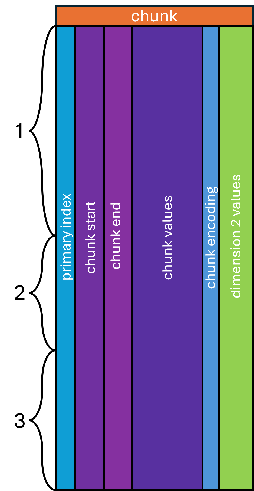

# Chunked Layout

The **chunked layout** treats one array — which must be sorted — as the "main"
axis, cutting it into chunks of a fixed size along that coordinate space (for
example steps of 50 m/z) and taking the same segments from the parallel arrays.
The main axis chunks' start, end, and a repeated index are recorded as columns;
each array may then be stored as-is or with an opaque transform (delta encoding,
Numpress, …). The start/end interval permits granular random access along *both*
the main axis and the source index. The top-level schema node is named `chunk`,
and the entity index column **MUST** be its first column.

<div class="mzp-figure" markdown>

</div>

<table class="chunk-table" markdown="0">
  <thead>
    <tr><th colspan="6">chunk</th></tr>
    <tr>
      <th>spectrum_index</th><th>mz_chunk_start</th><th>mz_chunk_end</th>
      <th>mz_chunk_values</th><th>chunk_encoding</th><th>intensity</th>
    </tr>
  </thead>
  <tbody>
    <tr><td>1</td><td>200</td><td>250</td><td>[0.0013, …, 0.0013]</td><td>MS:1003089</td><td>[…]</td></tr>
    <tr><td>1</td><td>250</td><td>300</td><td>[0.0014, …, 0.0014]</td><td>MS:1003089</td><td>[…]</td></tr>
    <tr><td>1</td><td>500</td><td>550</td><td>[0.0014, …, 0.0015]</td><td>MS:1003089</td><td>[…]</td></tr>
    <tr><td>…</td><td>…</td><td>…</td><td>…</td><td>…</td><td>…</td></tr>
    <tr><td>2</td><td>200</td><td>250</td><td>[0.0013, …, 0.0013]</td><td>MS:1003089</td><td>[…]</td></tr>
    <tr><td>2</td><td>350</td><td>400</td><td>[0.0014, …, 0.0014]</td><td>MS:1003089</td><td>[…]</td></tr>
    <tr><td>2</td><td>400</td><td>450</td><td>[0.0013, …, 0.0014]</td><td>MS:1003089</td><td>[…]</td></tr>
  </tbody>
</table>

This example uses delta encoding for the m/z chunk values, which is reconstructed
with very high precision for 64-bit floats. The m/z values inside
`mz_chunk_values` are not visible to the page index, but the `_chunk_start` and
`_chunk_end` columns are. The chunk values remain subject to Parquet encodings,
so they can be byte-shuffled for further compression.

## Column naming rules

1. **`<entity>_index`** (integer) — the index key for the entity this chunk
   belongs to.
2. **`<array_name>_chunk_start`** (float64) — the first coordinate value in the
   chunk, inclusive. Its array-index `buffer_format` **MUST** be `chunk_start`.
3. **`<array_name>_chunk_end`** (float64) — the last coordinate value in the
   chunk, inclusive. Its array-index `buffer_format` **MUST** be `chunk_end`.
4. **`<array_name>_chunk_values`** (list) — the encoded coordinates from
   `array_name` according to `chunk_encoding`. Its array-index `buffer_format`
   **MUST** be `chunk_values`.
5. **`chunk_encoding`** (CURIE) — how `<array_name>_chunk_values` were encoded;
   see [Chunk encodings](#chunk-encodings). Its array-index `buffer_format`
   **MUST** be `chunk_encoding`.

All other columns are expected to be `list` arrays whose names are simply their
`array_name` (with `buffer_format` `chunk_secondary`), or surrogate arrays with
`buffer_format` `chunk_transform`.

## Splitting data into chunks

A chunk table may be partitioned in any pattern, as long as the chunks are
non-overlapping and ascending. The chunking procedure must be `null`-aware — in
particular, aware of the `null` pairs that mark masked regions. The granularity
is configurable, trading random-access granularity against compression
efficiency.

??? example "Python — partitioning into chunks of width *k* with null pairs present"
    ```python
    import pyarrow as pa

    def null_chunk_every(data: pa.Array, width: float) -> list[tuple[int, int]]:
        """
        Partition a sorted numerical array into segments spanning `width` units.
        This operation is null-aware, so sparse arrays can be partitioned.
        Returns the (start, end) index of each chunk.
        """
        start = None
        n = len(data)
        i = 0
        # Find the first non-null position
        while i < n:
            v = data[i]
            if v.is_valid:
                start = v.as_py()
                break
            else:
                i += 1

        # If we never found a non-null position, just return a single chunk
        if start is None:
            return [(0, n)]

        chunks = []
        offset = 0
        threshold = start + width
        i = 0
        while i < n:
            v = data[i]
            if v.is_valid:
                v = v.as_py()
                if v > threshold:
                    if ((i + 1) < n) and (not data[i + 1].is_valid):
                        while ((i + 1) < n) and (not data[i + 1].is_valid):
                            i += 1
                    # Avoid a chunk of length 1, especially a null point; if so,
                    # relax the width requirement.
                    if i - offset > 1:
                        chunks.append((offset, i))
                        offset = i
                    while threshold < v:
                        threshold += width
            # Look ahead: this value is null, but the next is not.
            elif ((i + 1) < n) and (data[i + 1].is_valid):
                i += 1
                v = data[i].as_py()
                if v > threshold:
                    i -= 1
                    chunks.append((offset, i))
                    offset = i
                    while threshold < v:
                        threshold += width
            i += 1
        if offset != n:
            chunks.append((offset, n))
        return chunks
    ```

## Chunk encodings

### Basic encoding

> Chunk-encoding CV term: [`MS:1000576` — no compression](http://purl.obolibrary.org/obo/MS_1000576)

When storing centroids, or data that are not similarly spaced (as is usually the
case for pre-centroided spectra), but still wanting the chunked layout, no
special encoding of the chunk values is necessary. Values within each chunk are
written as-is to the chunk-values array. This does not improve compressibility,
but it keeps a consistent schema for other entries that *would* benefit from a
different encoding.

!!! note
    The start point is *excluded* from the chunk-values array.

### Delta encoding

> Chunk-encoding CV term: [`MS:1003089` — truncation, delta prediction and zlib compression](http://purl.obolibrary.org/obo/MS_1003089)

When data lie on a locally (*almost*) uniform grid using 64-bit floats,
compression improves by computing a delta encoding of the coordinates.

!!! note
    The start point is *excluded* from the chunk-values array.

??? example "Python — null-aware delta encode/decode"
    ```python
    import pyarrow as pa

    def null_delta_encode(data: pa.Array) -> pa.Array:
        """
        Delta-encode an Arrow array containing nulls. Nulls are encoded as null
        values and treated as 0.0 for the purpose of computing the next delta.
        """
        acc = []
        it = iter(data)
        # The first entry is the point of reference but not part of the delta
        # sequence unless it is `null`.
        last = next(it)
        if not last.is_valid:
            acc.append(last)

        for item in it:
            if item.is_valid:
                val = item.as_py()
                if last.is_valid:
                    acc.append(pa.scalar(val - last.as_py()))
                else:                       # treat the last value as 0.0
                    acc.append(item)
                last = item
            else:
                acc.append(item)            # carry the null forward
                last = item
        return pa.array(acc)


    def null_delta_decode(data: pa.Array, start: pa.Scalar) -> pa.Array:
        """Decode an Arrow array that was delta-encoded *with* nulls."""
        acc = []
        if not data[0].is_valid:
            if not data[1].is_valid:
                # started at a non-null value immediately followed by a null pair
                acc.append(start)
            start = pa.scalar(None, data.type)
        else:
            acc.append(start.as_py())
        last = start
        for item in data:
            if item.is_valid:
                val = item.as_py()
                if last.is_valid:
                    last = pa.scalar(val + last.as_py())
                    acc.append(last)
                else:                       # last value assumed zero
                    acc.append(item)
                    last = item
            else:
                acc.append(item)
                last = item
        return pa.array(acc)
    ```

### Numpress linear encoding

> Chunk-encoding CV term: [`MS:1002312` — MS-Numpress linear prediction compression](http://purl.obolibrary.org/obo/MS_1002312)

This uses the MS-Numpress linear-prediction method
([10.1074/mcp.O114.037879](https://www.mcponline.org/article/S1535-9476(20)33083-8/fulltext))
to compress the chunk values as raw bytes. Numpress produces a buffer of an
8-byte fixed point, a 4-byte value 0, a 4-byte value 1, and then 2-byte residuals
for all subsequent values. The array is therefore, by definition, not alignable
to a 4- or 8-byte type. It also has no concept of nullity, which makes it
**incompatible with [null marking](signal-data.md#null-marking)**.

To store Numpress-linear-encoded arrays, an extra column
`<array_name>_numpress_linear_bytes` is added alongside the
`<array_name>_chunk_values` column. It is a list of byte arrays
(`large_list<u8>` in Arrow parlance — **not** `large_binary`; see the
[discussion of string-type "optimisation"](https://arrow.apache.org/docs/format/Intro.html#variable-length-binary-and-string)).
Its array-index entry **MUST** have `buffer_format` `chunk_transform` and the
same array type, array name, data type, unit, and data-processing ID as the
`_chunk_values` column. The `transform` field **MUST** be `MS:1002312`.

!!! note
    The start point is *included* in the chunk-values array — it is a specific
    component of the Numpress-encoded bytes.

## Opaque array transforms

Sometimes we prefer to store data lossily in non-uniform, unaligned, or otherwise
non-standard types that have no physical representation in Parquet. MS-Numpress's
short logged float (SLOF) and positive-integer encodings are good examples. While
Numpress-linear handles the coordinate dimension, opaque transforms can also
encode the *secondary* arrays in chunks. These columns are recorded in the array
index with `buffer_format` `chunk_transform`, and the `transform` field is the
CURIE for the relevant method — for example
[`MS:1002314`](http://purl.obolibrary.org/obo/MS_1002314) for MS-Numpress SLOF.
The column's physical type **MUST** be a list of byte arrays, though the type in
the array index **MUST** be the *decoded* array's real type. Column names
**SHOULD** be of the form `<array_name>_<transform_name>_bytes`, e.g.
`intensity_numpress_slof_bytes`.

## Reading a single entry from the chunked encoding

To read a single entry (spectrum, chromatogram, …) stored in chunks:

0. Identify which columns are annotated as `chunk_start`, `chunk_end`,
   `chunk_encoding`, and `chunk_values` in the
   [array index](signal-data.md#the-array-index). The `<entity_type>_index`
   column **MUST** be the first column in the table, so it always has index 0.
1. Find the row group containing the entry's index value via the row-group
   metadata. Optionally, if the page index is available, find the row ranges of
   the pages that contain that index.
2. Read the selected row group (or page row range) and filter to rows whose
   `<entity_type>_index` equals the entry's index.
3. Optionally, sort the rows by their `chunk_start` value — usually ascending for
   the quantity being measured.
4. Process each selected row, decoding its `chunk_values` according to
   `chunk_encoding` and any `transform` in the array index. Unpack the
   `chunk_secondary` columns and apply any transforms, accumulating each column's
   arrays across rows. Some transforms require additional information from the
   entity's metadata table.
5. If the entry has additional [auxiliary arrays](auxiliary-arrays.md), read and
   decode them from the metadata table.
