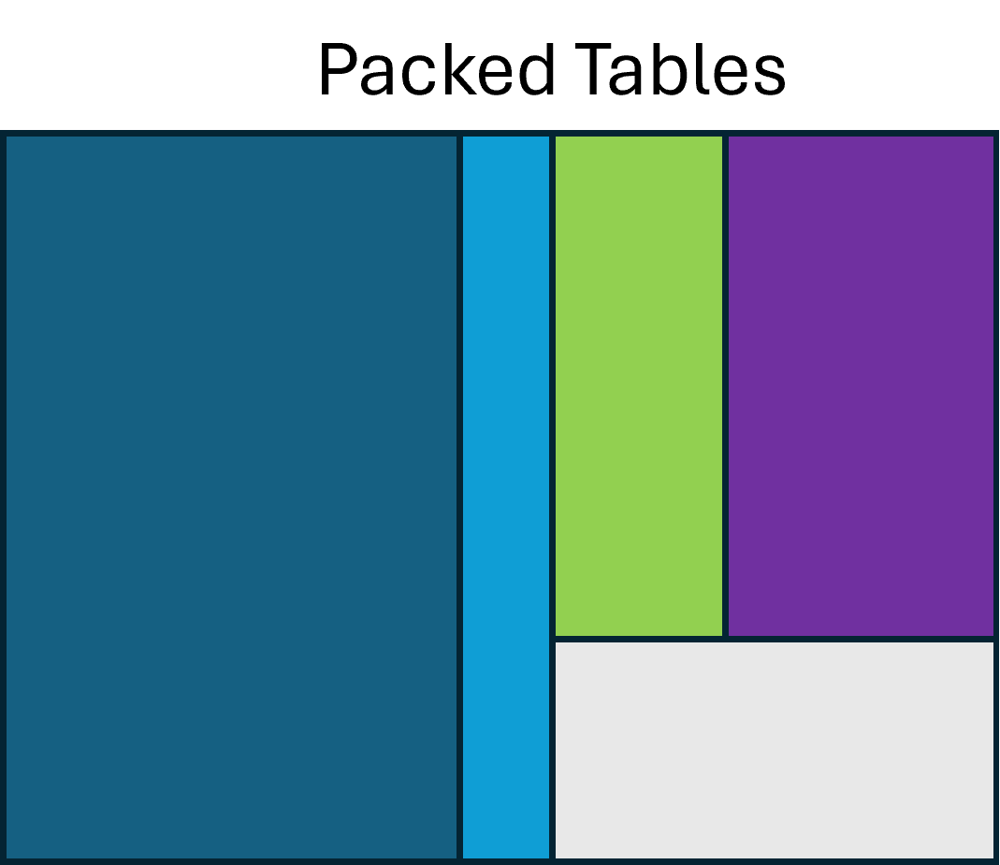
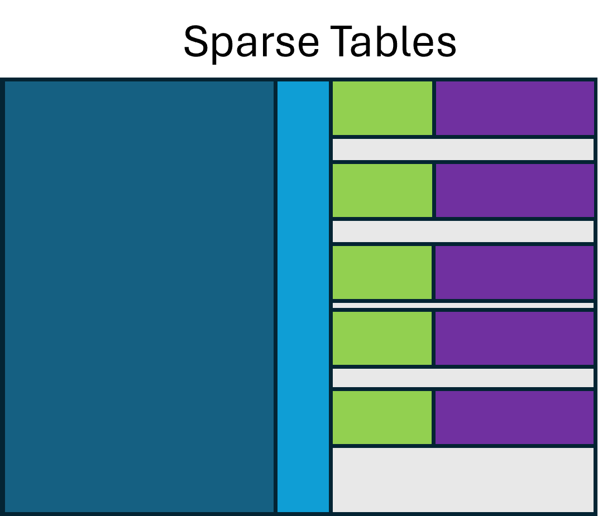

# Packed Parallel Metadata Tables

The `spectra_metadata.parquet` and `chromatograms_metadata.parquet` files store
multiple schemas *in parallel*. The root schema is made up of several branched
"group" (Parquet) or "struct" (Arrow) facets, any of which may be null at any
level. We borrow relational-database language — **primary key** and **foreign
key** — to describe how the parallel tables interconnect.

The example below shows two rows of related MS1 and MS2 spectra. Treat
`scan.source_index`, `precursor.source_index`, `precursor.precursor_index`,
`selected_ion.source_index`, and `selected_ion.precursor_index` as foreign keys
with respect to `spectrum.index`, the primary key:

- `precursor.source_index` refers to the `spectrum` that this `precursor` record
  belongs to.
- `precursor.precursor_index` refers to the `spectrum` that *is* the precursor of
  the spectrum referenced by `precursor.source_index`.
- Together, `(precursor.source_index, precursor.precursor_index)` forms a
  compound key.

Any of these columns may be `null`, meaning that such a record does not exist in
the table. The same applies to the `selected_ion` facet.

<table class="packed-table" markdown="0">
  <thead>
    <tr>
      <th colspan="4">spectrum</th>
      <th colspan="2">scan</th>
      <th colspan="3">precursor</th>
      <th colspan="3">selected_ion</th>
    </tr>
    <tr>
      <th>index</th>
      <th>id</th>
      <th>time</th>
      <th>MS_1000511_<br/>ms_level</th>
      <th>source_<br/>index</th>
      <th>MS_1000616_preset_<br/>scan_configuration</th>
      <th>source_<br/>index</th>
      <th>precursor_<br/>index</th>
      <th>isolation_<br/>window</th>
      <th>source_<br/>index</th>
      <th>precursor_<br/>index</th>
      <th>MS_1000744_selected_<br/>ion_mz</th>
    </tr>
  </thead>
  <tbody>
    <tr><td colspan="12" style="text-align:center;">…</td></tr>
    <tr>
      <td>502</td><td>scan=502</td><td>20.51</td><td>1</td>
      <td>502</td><td>3</td>
      <td>503</td><td>502</td><td>{…}</td>
      <td>503</td><td>502</td><td>233.5</td>
    </tr>
    <tr>
      <td>503</td><td>scan=503</td><td>20.531</td><td>2</td>
      <td>503</td><td>2</td>
      <td>504</td><td>502</td><td>{…}</td>
      <td>504</td><td>502</td><td>562.3</td>
    </tr>
    <tr><td colspan="12" style="text-align:center;">…</td></tr>
  </tbody>
</table>

## Controlled Vocabulary Terms

Like mzML, mzPeak makes heavy use of controlled vocabularies to represent rich
metadata. mzPeak uses CV terms in three ways:

1. **As columns.** When a term is used as a column name, that column's values are
   either the defined value of the term's expected type (e.g. via
   `has_value_type`) *or* a CURIE for a child of the column-name term. For
   example:
    - The column [`MS_1000525_spectrum_representation`](http://purl.obolibrary.org/obo/MS_1000525)
      holds CURIEs for a child term —
      [`MS:1000127`](http://purl.obolibrary.org/obo/MS_1000127) "centroid
      spectrum" or [`MS:1000128`](http://purl.obolibrary.org/obo/MS_1000128)
      "profile spectrum" — as appropriate for the spectrum in that row.
    - The column [`MS_1000511_ms_level`](http://purl.obolibrary.org/obo/MS_1000511)
      holds an integer value.
2. **As structural elements.** In several places — such as the
   [array index](signal-data.md#the-array-index) — CURIEs reference named
   concepts that explain the semantics of a data structure without changing its
   shape.
3. **As pluggable metadata carriers** in `parameters` arrays, analogous to
   `<cvParam/>` in mzML. Every schema facet of a metadata table may carry a
   `parameters` column.

### The `parameters` list

The `parameters` column may be present in any facet of a metadata table. It
**MUST** be a list of the following schema:

```python
optional group field_id=-1 parameters (List) {
  repeated group field_id=-1 list {
    optional group field_id=-1 item {
      optional group field_id=-1 value {
        optional int64   field_id=-1 integer;
        optional double  field_id=-1 float;
        optional binary  field_id=-1 string (String);
        optional boolean field_id=-1 boolean;
      }
      optional binary field_id=-1 accession (String);
      optional binary field_id=-1 name (String);
      optional binary field_id=-1 unit (String);
    }
  }
}
```

The `parameters.list.item.value` group has a slot for each data type, so a
parameter can take exactly one of these value types; unused slots **MUST** be
`null`. A parameter **MAY** carry a unit, given as a CV-term CURIE in
`parameters.list.item.unit`. As with mzML's `<userParam/>`, an *uncontrolled*
parameter may be stored simply by leaving `parameters.list.item.accession` empty.

!!! note "Naming and column promotion"
    - Parquet columns **MUST** be uniquely named, so if a parameter appears more
      than once in a single entry it **MUST** be stored in the `parameters`
      column.
    - Writers are encouraged, when sufficient context is available, to promote
      parameters that are present in most rows of a table to *columns*. This is
      more space-efficient and enables predicate filtering.

!!! question "Open item — lists and maps"
    Whether `parameters` values should also support list- or map-valued types is
    still under discussion.

### Typing parameter values

When a term has a value and it is stored in the `parameters` list, the value
**MUST** use one of the value types in the fixed schema above. When a term is
instead promoted to its own column, the value may use any Parquet data type.
This flexibility lets writers pick an appropriate size and precision, but it can
create redundant reader code — a column expected to hold an integer might be
written as an 8-, 16-, 32-, or 64-bit integer, signed or unsigned. Some
languages handle this naturally with dynamic typing or generics; others need a
separate implementation per physical type.

Recommended physical types:

- **Integral values that are *not* indices or identifiers** — prefer signed 32-
  or 64-bit, as needed to cover the value's domain.
- **Indices or identifiers represented as integers** — prefer unsigned 32- or
  64-bit. Dictionary encoding reduces most cases to ~8 bits per variant on disk
  anyway.
- **Floating-point values** — prefer 64-bit doubles unless precision is truly of
  no concern. For repetitive values (e.g. collision energy), dictionary encoding
  drops the on-disk cost well below 32 bits per value.
- **Strings and lists** — prefer 64-bit offsets ("large strings"/"large lists"),
  but write code that supports both 32- and 64-bit offsets. This matters
  especially for strings, where the offset is a *byte* offset, not an item
  offset.

### Column name inflection

When a CV-term concept is represented as a column, the column name **SHOULD** be
constructed by the following inflection rules:

1. The base column name is `${CV_CODE}_${CV_ACCESSION}_${CLEANED_NAME}` where:
    1. `${CV_CODE}` identifies the controlled vocabulary itself — `MS` for
       PSI-MS, `UO` for the Units of Measurement Ontology.
    2. `${CV_ACCESSION}` is the accession number. For `MS:1000016` "scan start
       time" this is `1000016`.
    3. `${CLEANED_NAME}` is the term's name with any character that is not valid
       in a Parquet column name replaced by `_`. The regular expression
       `/[^a-zA-Z0-9_\\-]+/` matches all such characters in ASCII. For
       `MS:1000016`, the result is `MS_1000016_scan_start_time`.
    4. Because the string "m/z" appears so frequently, it **SHOULD** be rewritten
       as `mz` to avoid extra underscores. For `MS:1000504` "base peak m/z", the
       result is `MS_1000504_base_peak_mz`.
2. **If a single unit applies to every value in the column**, it **SHOULD** be
   appended as `_unit_${UNIT_CV_CODE}_${UNIT_CV_ACCESSION}`. For example,
   `MS_1000528_lowest_observed_mz_unit_MS_1000040` is `MS:1000528` "lowest
   observed m/z" with unit `MS:1000040` "m/z".
3. **If the unit varies across the column**, it **SHOULD** be carried in a
   separate column whose name is the inflected name with `_unit` appended, whose
   values are the unit CURIEs.

## Null semantics for metadata

A row value that is `null` is treated as absent — having no value. If a *foreign
key* column is `null`, assume the corresponding record does not exist (as when an
MS2 spectrum is stored without its MS1 precursor, as in MGF files, or in a slice
of a run). If the *primary key* of a facet is `null`, the reader **SHOULD** skip
that facet's columns for that row.

A writer **SHOULD** minimise the number of interspersed all-`null` rows, though
this is not strictly required. Minimising interspersed nulls improves
compressibility. In the figures below, "Packed Tables" keeps the rows of each
parallel facet contiguous, while "Sparse Tables" intermixes rows of nulls.

<div class="mzp-figure" markdown>


</div>
