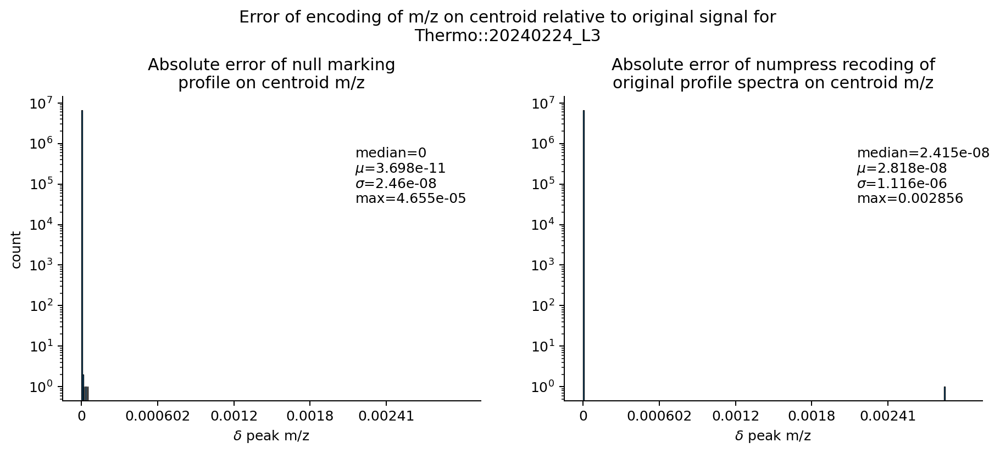
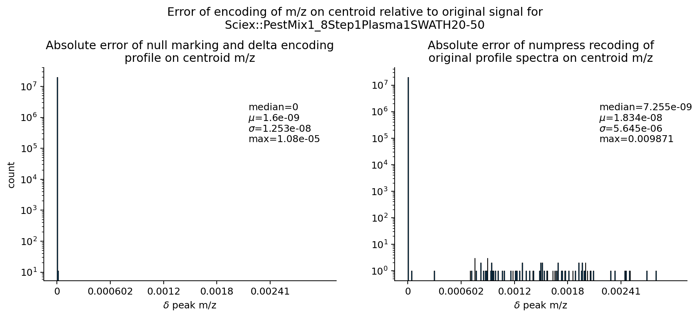

# Signal Data Model

## Arrays and columns

In mass spectrometry it is common to speak of a spectrum *having* an m/z array,
as a synonym for having been measured in the m/z dimension, with a parallel
intensity array giving the abundance of the signal at each m/z. In mzML, the two
dimensions may even use different physical data types on different spectra in the
same file, and there are legitimate use-cases for that.

mzPeak can store array data in two ways:

- **As a column** in a signal data layout — the array is burned into the
  schema and registered in the [array index](#the-array-index). It is encoded
  directly by Parquet, subject to Parquet's adaptive encoding and compression,
  and — crucially — can be searched and sliced via the page index.
- **As an [auxiliary array](auxiliary-arrays.md)** — stored in the associated
  metadata table's `*.auxiliary_arrays` value for that entity's row. Auxiliary
  arrays can be individually configured by the writer (custom compression, data
  type, decoding, or cvParams), but they **cannot** be searched or sliced
  without decoding the entire array, just as in mzML.

Currently, the first sorted array is assumed to be the axis around which all
other values are arranged — *sorting rank 0*. Any arrays that are shorter or
longer than this axis **SHOULD** be stored as auxiliary arrays instead.

!!! warning "Re-sort unsorted ranked arrays"
    When writing, if an array that has a sorting rank is not sorted, the entry's
    data arrays **MUST** be re-sorted accordingly. Failing to do so introduces
    integrity errors.

## The Array Index

To annotate what kind of array a column *is*, mzPeak stores a JSON-serialised
**array index** in the [Parquet key–value metadata](../foundations/parquet.md#the-metadata-keyvalue-pairs).
It is a list of structures describing each array using controlled vocabulary. A
column is part of the Parquet schema and must always exist with a homogeneous
value type (or be `null`) for each row.

The array index is stored in the Parquet metadata of the
[`data arrays`](../archive/data-kinds.md) or
[`peaks`](../archive/data-kinds.md) files under
`<entity_type>_array_index` — e.g. `spectrum_array_index` for spectra or
`chromatogram_array_index` for chromatograms.

```json
{
  "prefix": "point",
  "entries": [
    {
      "context": "spectrum",          // This array describes a spectrum
      "path": "point.mz",             // Column path in the Parquet schema
      "data_type": "MS:1000523",      // CV term for the data type of this array
      "array_type": "MS:1000514",     // CV term for the array itself
      "array_name": "m/z array",      // Human-readable name; also where a custom
                                      //   `non-standard array` name is stored
      "unit": "MS:1000040",           // Values are in m/z
      "buffer_format": "point",       // This column uses the point layout
      "transform": null,              // No transformation applied
      "data_processing_id": null,     // Use the default data-processing method
      "buffer_priority": "primary",   // Default column for m/z queries
      "sorting_rank": 0               // Sorted within entries; other arrays sort after
    },
    {
      "context": "spectrum",
      "path": "point.intensity",
      "data_type": "MS:1000521",
      "array_type": "MS:1000515",
      "array_name": "intensity array",
      "unit": "MS:1000131",           // Detector counts
      "buffer_format": "point",
      "transform": null,
      "data_processing_id": null,
      "buffer_priority": "primary",
      "sorting_rank": null            // Imposes no sorting order on the data
    }
  ]
}
```

This array index describes the table shown for the
[point layout](point-layout.md). It is governed by the JSON Schema
[`schema/array_index.json`](https://github.com/HUPO-PSI/mzPeak-specification/blob/main/schema/array_index.json).

### Buffer format

Depending on the signal data layout in use, arrays are stored in different
formats. The available `buffer_format` values are:

| `buffer_format` | Used by | Meaning |
| :-- | :-- | :-- |
| `point` | [point](point-layout.md) | The array is stored in the point layout. The point layout is all-or-nothing — **every** array must be `point`. |
| `chunk_values` | [chunked](chunked-layout.md) | The "main" axis values bounded between a chunk's start and end, encoded for better compressibility (in addition to Parquet's own encoding). |
| `chunk_start` | [chunked](chunked-layout.md) | The starting value of the main axis for the chunk, inclusive. |
| `chunk_end` | [chunked](chunked-layout.md) | The ending value of the main axis for the chunk, inclusive. It should be less than the next chunk's `chunk_start`. |
| `chunk_encoding` | [chunked](chunked-layout.md) | A CURIE indicating how `chunk_values` was encoded. |
| `chunk_secondary` | [chunked](chunked-layout.md) | Values of an array other than the main axis for the chunk. |
| `chunk_transform` | [chunked](chunked-layout.md) | Raw bytes of an array in the chunk that was opaquely transformed (e.g. with MS-Numpress). May appear *in addition* to a referenced `chunk_values` or `chunk_secondary` column. |

The chunked layout currently supports a single chunking dimension. A file in the
chunked layout **MUST** use `chunk_start`, `chunk_end`, `chunk_encoding`, and
`chunk_values` *exactly once* each.

### Buffer priority and naming

In Parquet, all column names and types must be known before writing, and no two
columns may share the same name and path. Normally there is one coordinate
column (e.g. m/z or time) and one intensity column. If you have intensity arrays
with different units or data types, they must be defined as separate arrays in
the array index and therefore have distinct names. While uncommon for spectra,
this is unavoidable for [diagnostic traces](../archive/entity-types.md) stored as
chromatograms.

For ergonomics, common columns should have simple, consistent names — this makes
files easier to use from raw Parquet tooling. The most common version of each
array type (as defined by the implementation) **SHOULD** have a `buffer_priority`
of `primary` and receive a short, consistent name. The recommended short names:

| Accession | Name | Column name |
| :-- | :-- | :-- |
| MS:1000514 | m/z array | `mz` |
| MS:1000515 | intensity array | `intensity` |
| MS:1000516 | charge array | `charge` |
| MS:1000517 | signal to noise array | `signal_to_noise` |
| MS:1000595 | time array | `time` |
| MS:1000617 | wavelength array | `wavelength` |
| MS:1002530 | baseline array | `baseline` |
| MS:1002529 | resolution array | `resolution` |
| MS:1002893 | ion mobility array | `ion_mobility` |
| MS:1003007 | raw ion mobility array | `raw_ion_mobility` |
| MS:1002816 | mean ion mobility array | `mean_ion_mobility` |
| MS:1003154 | deconvoluted ion mobility array | `deconvoluted_ion_mobility` |
| MS:1003008 | raw inverse reduced ion mobility array | `raw_inverse_reduced_ion_mobility` |
| MS:1003006 | mean inverse reduced ion mobility array | `mean_inverse_reduced_ion_mobility` |
| MS:1003155 | deconvoluted inverse reduced ion mobility array | `deconvoluted_inverse_reduced_ion_mobility` |
| MS:1003153 | raw ion mobility drift time array | `raw_drift_time` |
| MS:1002477 | mean ion mobility drift time array | `mean_drift_time` |
| MS:1003156 | deconvoluted ion mobility drift time array | `deconvoluted_ion_mobility_drift_time` |

## Data arrays, encoding, transformations, and Parquet

Parquet can write [page indices](https://parquet.apache.org/docs/file-format/pageindex/)
on any *leaf* column, based on the value being stored *before* its
[encoding](https://parquet.apache.org/docs/file-format/data-pages/encodings/) and
[compression](https://parquet.apache.org/docs/file-format/data-pages/compression/).
This means we must take care when storing data cleverly: a transformation that
obscures the stored value from the page index also disables predicate filtering
on it. The techniques below are written in terms of spectra but apply more
broadly.

### Zero run stripping

Some vendors produce profile arrays with large "empty" regions of zero-intensity
points along a semi-regular m/z axis. These regions hold little information, so
all but the first and last zero-intensity points of a run are removed. This is
only meaningful for profile data; readers **SHOULD** assume that zero runs have
been stripped.

A **zero run** is a sequence of three or more zero values, reduced to just its
first and last positions. Zero runs can be very long and, outside of scenarios
that assume a complete coordinate grid, provide no value. If a zero run needs to
be reconstructed beyond the flanking points, the same method used for filling
[null-marked](#null-marking) values can extend the run.

??? example "Python — finding the positions that are *not* part of a zero run"
    ```python
    def find_where_not_zero_run(data: Sequence[Number]) -> Sequence[int]:
        """
        Construct a list of positions that are not part of a zero run.

        A zero run is any position *i* such that:
          1. ``x[i] == 0``
          2. ``(i == 0) or (x[i - 1] == 0)``
          3. ``(i == (len(x) - 1)) or (x[i + 1] == 0)``

        We build a position list because we need to extract these positions
        from ALL dimension arrays for this entity, not just the current array.
        """
        n = len(data)
        n1 = n - 1
        was_zero = False
        acc = []
        i = 0
        while i < n:
            v = data[i]
            if v is not None:
                if v == 0:
                    if (was_zero or (len(acc) == 0)) and ((i < n1 and data[i + 1] == 0) or i == n1):
                        pass
                    else:
                        acc.append(i)
                    was_zero = True
                else:
                    acc.append(i)
                    was_zero = False
            else:
                acc.append(i)
                was_zero = False
            i += 1
        return np.array(acc, dtype=np.uintp)
    ```

### Null marking

For spectra with many small gaps, even zero-run stripping leaves too much
unhelpful information. Instead, we can replace the flanking zero-intensity points
with `null` m/z and intensity values; Parquet then skips storing the expensive
32- and/or 64-bit values, retaining only the validity-bitmap bit. Separately, we
fit a simple m/z-spacing model by weighted least squares of the form:

$$
    \delta mz \sim \beta_0 + \beta_1\,mz + \beta_2\,mz^2 + \epsilon
$$

??? example "Python — fitting the weighted least-squares spacing model"
    ```python
    class DeltaCurveRegressionModel:
        beta: np.ndarray

        def __init__(self, beta: np.ndarray):
            self.beta = beta

        @classmethod
        def fit(cls, mz_array, delta_array, weights=None, threshold=None, rank=2):
            if weights is None:
                weights = np.ones(len(mz_array))

            if threshold is None:
                threshold = 1.0

            # Drop all entries where the gap between m/z values > threshold
            raw = mz_array[1:][delta_array <= threshold]
            w = weights[1:][delta_array <= threshold]
            y = delta_array[delta_array <= threshold]

            # Build the design matrix
            data = [np.ones_like(raw)]
            for i in range(1, rank + 1):
                data.append(raw**i)
            data = np.stack(data, axis=-1)

            # Use the QR decomposition to solve the weighted least-squares problem
            # to estimate weights predicting δ m/z.
            # https://stats.stackexchange.com/a/490782/59613
            chol_w = np.sqrt(w)
            qr = np.linalg.qr(chol_w[:, None] * data)
            v = qr.Q.T.dot(chol_w * y)
            beta = solve_triangular(qr.R, v)

            # Numerically equivalent to and more stable than the direct inversion
            # beta = np.linalg.inv((data.T * w).dot(data)).dot(data.T * w).dot(y)
            return cls(beta)

        def predict(self, mz: float) -> float:
            acc = self.beta[0]
            for i in range(1, len(self.beta)):
                acc += self.beta[i] * mz ** i
            return acc
    ```

When reading null-marked data, use either the local second-median \(\delta mz\)
or the learned model for that spectrum to compute the m/z spacing for singleton
points, achieving a very accurate reconstruction. Because the non-zero m/z points
are unchanged, a peak's apex or centroid is unaffected. If a peak is composed of
only three points — including the two zero-intensity flanks — no meaningful peak
model can be fit anyway, so the minuscule angle change is effectively lossless.

The model parameters learned for each entry **MUST** be stored in that entry's
row in the associated metadata table, as `mz_delta_model`.

!!! question "Open item — generalise `mz_delta_model`"
    Should `mz_delta_model` become a CV parameter and be dissociated from m/z
    specifically, so the same mechanism can serve other coordinate axes? This is
    likely desirable.

<div class="mzp-figure" markdown>


</div>

All MS-Numpress compression methods remain available and still give superior size
reduction, at the cost of slightly larger accuracy loss. Using Numpress is a
*transformation* and requires the [chunked layout](chunked-layout.md).

#### Finding flanking zero pairs

Zero-intensity points on the flanks of peaks still cost non-trivial storage in
sparse datasets. This step matches *only* the zero-intensity points that occur on
the flanks of profile peaks — not all zero-intensity points. Once found, these
indices construct the `null` mask (the Arrow "validity bitmap"), which is
equivalent to how a Parquet column chunk would represent them.

??? example "Python — masking positions that are two zeros in a row"
    ```python
    def is_zero_pair_mask(data: Sequence[Number]) -> "np.typing.NDArray[np.bool_]":
        '''Create a boolean mask for positions composed of two zeroes in a row.'''
        n = len(data)
        n1 = n - 1
        was_zero = False
        acc = []
        for i, v in enumerate(data):
            if v == 0:
                if was_zero or (i < n1 and data[i + 1] == 0):
                    acc.append(True)
                else:
                    acc.append(False)
                was_zero = True
            else:
                acc.append(False)
                was_zero = False
        return np.array(acc)
    ```

#### Decoding null pairs

Decoding null pairs — undoing null marking — means finding regions bounded by two
`null`s (or by the start of the array and a `null`, or a `null` and the end of
the array), then filling the null values with either a locally estimated value
(when more than one value is available to estimate the median delta) or the
regression model described above (for a single point).

Unpaired `null` values **MAY** appear only as the first or last `null` in the
array; any other unpaired `null` is an unrecoverable error. A run of three or
more `null` values **MAY** be recoverable but should not occur under normal
operation.

The locally estimated value **SHOULD** be the second median of the spacing of the
current segment's non-`null` values. The regression model predicts the spacing
from the single non-null value of a segment that has only one.

??? example "Python — filling *null*-marked values"
    ```python
    def find_pairs(mask: Sequence[bool]) -> Sequence[int]:
        """
        Construct index ranges between pairs of ``True`` values in ``mask``.

        The first and last ranges include the start and end of the array even if
        the mask does not begin/end with a ``True``. The result has two columns:
        the start and end indices of each span between two ``True`` values (or the
        array termini).

        .. warning::
          This can fail or produce incorrect output if there are runs of ``True``
          values longer than 2. Buffer all data for an entry before calling this
          so that batches do not artificially disrupt pairs.
        """
        parts = []
        indices = np.where(mask)[0]
        if len(indices) == 0:
            return np.array([[0, len(mask)]])
        if indices[0] != 0:
            parts.append([0])
        parts.append(indices)
        if indices[-1] != len(mask) - 1:
            parts.append([len(mask) - 1])
        indices = np.concat(parts)
        indices = indices.reshape((-1, 2))
        indices[:, 1] += 1
        return indices


    def estimate_median_delta(data: Sequence[Number]) -> tuple[Number, np.typing.NDArray]:
        """Find the 2nd median of ``np.diff(data)`` — a crude spacing estimate."""
        deltas = np.diff(data)
        median = np.median(deltas)
        deltas_below = deltas[deltas <= median]
        median = np.median(deltas_below)
        return median, deltas_below


    def fill_nulls(data: pa.Array, common_delta: DeltaModelBase) -> "np.typing.NDArray":
        """Fill ``null`` values using ``common_delta`` or a locally estimated median delta."""
        if not isinstance(common_delta, DeltaModelBase):
            if isinstance(common_delta, Number):
                common_delta = ConstantDeltaModel(common_delta)
            else:
                common_delta = DeltaCurveRegressionModel(np.asarray(common_delta))

        pair_indices = find_pairs(data.is_null())

        chunks = []
        for (start, end) in pair_indices:
            chunk = np.asarray(data.slice(start, end - start))
            n = len(chunk)
            has_real = chunk[~np.isnan(chunk)]
            n_has_real = len(has_real)
            if n_has_real == 1:
                # A singleton point with one or two sides to pad
                if n == 2:
                    if np.isnan(chunk[0]):
                        chunk[0] = chunk[1] - common_delta(chunk[1])
                    else:
                        chunk[1] = chunk[0] + common_delta(chunk[0])
                elif n == 3:
                    dx = common_delta(chunk[1])
                    chunk[0] = chunk[1] - dx
                    chunk[2] = chunk[1] + dx
                else:
                    raise Exception()
            else:
                # A run of values — estimate a more accurate delta from the data
                dx, _ = estimate_median_delta(has_real)
                if np.isnan(chunk[0]):
                    chunk[0] = chunk[1] - dx
                if np.isnan(chunk[-1]):
                    chunk[-1] = chunk[-2] + dx
            chunks.append(chunk)
        return np.concat(chunks)
    ```

### Null semantics for signal data

Unless otherwise noted, readers **SHOULD** treat `null` values in the sorting-
rank-0 array of an entry as governed by this model, with parallel `null` values
in any intensity arrays read as `0`. The former should carry a `transform` of
[`MS:1003901`](http://purl.obolibrary.org/obo/MS_1003901) and the latter a
`transform` of [`MS:1003902`](http://purl.obolibrary.org/obo/MS_1003902). All
other values at those points are read as-is, with null semantics meaning the
value was absent. Writers using null marking **SHOULD** use `null` only for the
first sorting dimension and its associated intensity value; all other columns
should be written as-is.

## Why a top-level node?

**Couldn't we just unwrap the top-level `point`/`chunk` struct and move on?**

Perhaps, but keeping a top-level node open three doors:

1. **Clear schema signalling.** When you see `point` at the root of the schema
   you know this is a [point-layout](point-layout.md) file, not a
   [chunked-layout](chunked-layout.md) one.
2. **Unaligned proprietary data.** A specialised writer or reader might embed
   information not directly connected to the primary schema's addressable unit
   (a spectrum, a data point). The top-level node leaves a place for that.
3. **Future table packing.** Early in mzPeak's design we tried to pack tables
   together as much as possible (as in the
   [packed parallel tables](metadata-tables.md) layout), but that proved very
   inefficient to *write* despite being no slower to *read* — possibly an
   implementation detail rather than a Parquet limitation. Keeping a top-level
   node leaves the door open to revisit this without a schema-breaking change.
